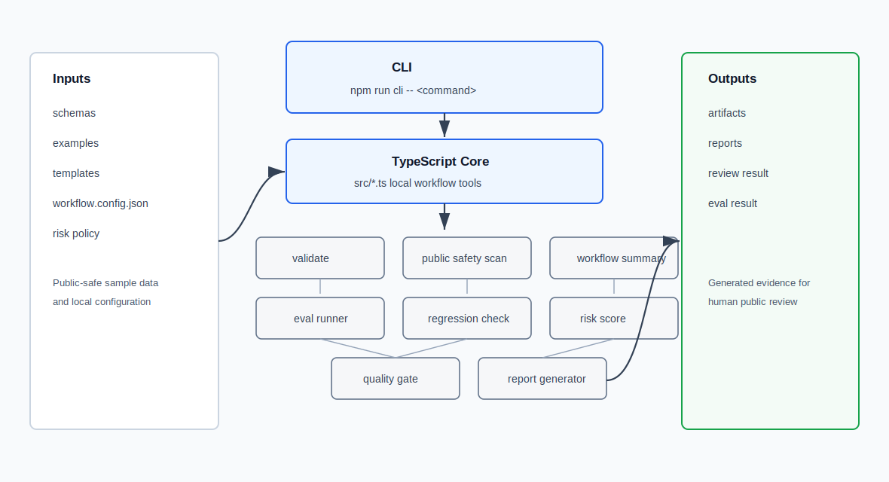
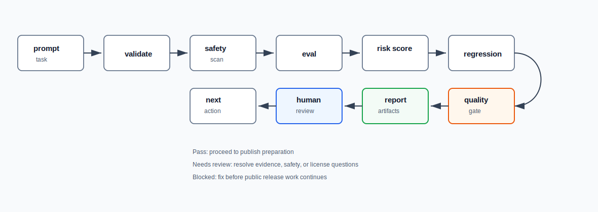

# AI Workflow Lab Public

AI Workflow Lab Public is a small TypeScript LLM Ops / AI workflow foundation. It shows how to run local validation, public-safety scanning, workflow summaries, evals, regression checks, risk scoring, quality gates, reports, artifacts, tests, and CI candidate checks without external APIs or real operational data.

This is not a chatbot demo and not a content-generation pipeline. The repository is framed for engineering workflows: bounded tasks, reproducible checks, review gates, run evidence, and public-release readiness.

## 30-Second Signal

- TypeScript tooling under `src/` is the implementation core.
- `npm run cli -- run-all` exercises validate, scan, summary, eval, regression, gate, report, test, and smoke paths.
- `examples/golden_cases/` contains positive and negative workflow cases.
- `baselines/eval_baseline.json` makes eval drift visible.
- `artifacts/latest/` and `reports/latest.md` keep generated review evidence.
- `docs/adr/` records why the repo uses local TypeScript tooling, no external APIs, policy gates, golden and negative cases, regression, and quality gates.
- Shell scripts are thin compatibility launchers only.

## Architecture Overview



## Execution Flow



## Quick Start

Run the full local health check:

```bash
npm install
npm run smoke
```

Run the complete CLI path:

```bash
npm run cli -- run-all
```

Inspect the latest generated evidence:

```bash
npm run report
cat reports/latest.md
ls artifacts/latest
```

The quality gate can return `needs_review` while commands still pass. That is expected when negative cases or human-review items are present.

## Main Commands

| Command | Purpose |
| --- | --- |
| `npm run validate` | Validate schemas, examples, config, eval results, regression results, and gate results with the local schema subset. |
| `npm run scan` | Run the public-safety term scan over docs, prompts, examples, templates, config, reports, and review TODOs. |
| `npm run summary` | Generate a portfolio summary from golden cases, run receipts, and review results. |
| `npm run eval` | Evaluate positive and negative golden cases. |
| `npm run regression` | Compare current eval counts with `baselines/eval_baseline.json`. |
| `npm run gate` | Combine validate, scan, eval, regression, risk, and review result status into one publication-readiness result. |
| `npm run report` | Generate `reports/latest.md`. |
| `npm run test` | Run the Node `node:test` suite. |
| `npm run smoke` | Run the end-to-end local repository health check. |
| `npm run cli -- <command>` | Use the single CLI entrypoint for `validate`, `scan`, `summary`, `eval`, `regression`, `gate`, `report`, `run-all`, and `smoke`. |

## What To Review First

- `docs/walkthrough.md`: 3-minute, 5-minute, 10-minute, and interview-prep paths.
- `docs/architecture.md`: system components and gate relationships.
- `docs/evaluation.md`: eval, risk score, regression, and quality gate behavior.
- `docs/operations.md`: how to operate the repo and inspect generated evidence.
- `docs/adr/`: design decisions for implementation language, local execution, and review gates.
- `TODO_public_review.md`: final manual checklist before publishing.

## Repository Map

```text
.
├── src/                         TypeScript implementation logic
├── tests/                       node:test coverage for core behavior
├── schemas/                     JSON record shapes
├── examples/                    public-safe sample cases, receipts, and results
├── templates/                   reusable placeholders for new workflow assets
├── config/risk_policy.json      local risk scoring policy
├── workflow.config.json         local workflow configuration
├── baselines/                   accepted eval baseline counts
├── artifacts/latest/            generated eval, regression, gate, and summary evidence
├── reports/latest.md            generated Markdown report
├── docs/                        architecture, operations, evaluation, walkthrough, ADRs, images
├── .github/workflows/ci.yml     CI candidate
├── LICENSE_CANDIDATE.md         pre-publication license decision note
└── TODO_public_review.md        final public-review checklist
```

## Workflow Shape

```text
prompt / task
  -> validate
  -> public safety scan
  -> eval
  -> risk score
  -> regression
  -> quality gate
  -> report and artifacts
  -> human review
  -> next action
```

The loop is intentionally small: define a bounded task, capture evidence, validate structure, scan safety risk, evaluate golden and negative cases, compare against a baseline, run a quality gate, and produce reviewable artifacts.

## LLM Ops / SRE / Platform Value

This repo connects AI-assisted work to operating practices that matter in SRE, Platform Engineering, AIOps, and LLM Ops:

- Bounded task contracts instead of open-ended prompts.
- Local deterministic checks before human review.
- Evaluation cases that include expected rejection paths.
- Regression checks that make workflow drift visible.
- Quality gates that separate mechanical pass from public-release readiness.
- Generated artifacts and reports for handoff evidence.
- ADRs that make design tradeoffs explicit.
- CI candidate coverage for the same local checks.

## Public-Safe Scope

The repository uses synthetic examples only. It does not include real operational records, real organization names, local-only paths, or restricted values. It does not call external LLM APIs.

Before publishing, run:

```bash
npm run cli -- run-all
rg -n "token|secret|password|api_key|credential|client_secret|private|customer|顧客|社内|実名|email|mail" .
```

Then inspect `TODO_public_review.md`, `reports/latest.md`, `artifacts/latest/`, the SVG diagrams, and `LICENSE_CANDIDATE.md`. The formal license is intentionally not decided in this file; choose it before public release.
